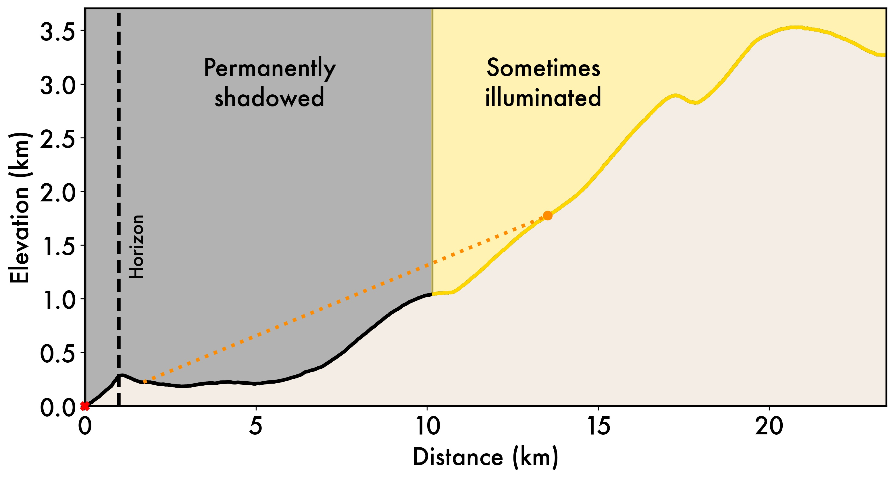

# DoubleShadows

<h2>
Background
</h2>

Topographic depressions near the poles of low-obliquity planetary bodies such as the Moon can be perennially shadowed from the Sun's light. However, illumination (and, consequently, temperature) is not constant even within individual permanently shadowed regions (PSRs). Topographic depressions, e.g., small craters, within PSRs can be shielded not only from direct solar illumination but also from secondary illumination sources like scattered sunlight and thermal emission from nearby sunlit terrain.

A point is permanently shadowed (PSR) if the solar disc never rises above the horizon from that point.

A point is doubly shadowed (DPSR) if it is a PSR and has no direct line of sight to any non-PSR surfaces.

<h2>
Methods
</h2>
Permanently shadowed regions are mapped using digital terrain models from the Lunar Orbiter Laser Altimeter via the horizon illumination method of Mazarico et al. [2011]. The resulting binary PSR map is then fed forward into a raycasting algorithm that identifies all surface facets that are visible from a given point on the lunar surface. If every visible facet in every direction is permanently shadowed, that point is doubly shadowed.

<h2>
Results
</h2>

This repository contains Python files for single and double shadow mapping and subsequent analysis. Data files include the PSR and DPSR binary maps at various resolutions and shadow size-frequency distributions (.txt).

<h2>
Reference
</h2>

More information can be found in the full paper, O'Brien & Byrne [2022] (link TBD)
